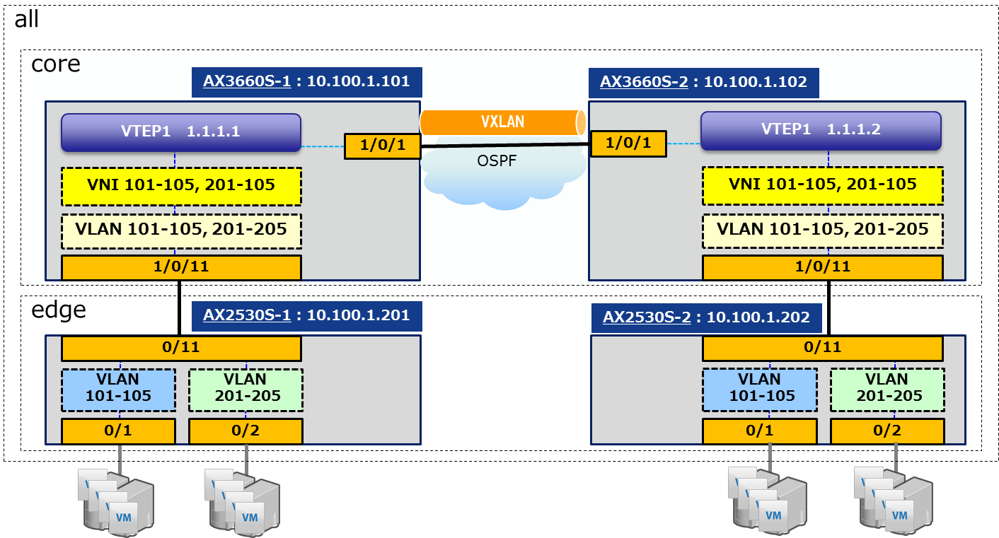
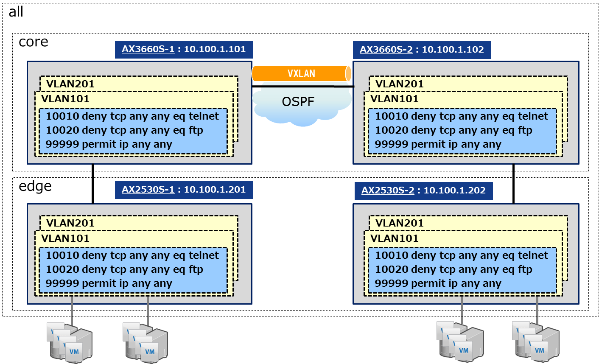
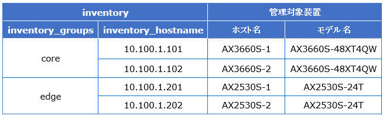

# 本リポジトリについて

本リポジトリは、単純にコンフィグレーション設定や機器から情報収集をただ行うだけではなく、コンフィグレーション設定前後でのコンフィグ保存や設定にあたっての状態確認といった手順を含めたサンプルPlaybookを掲載しています。
少しの修正ですぐにでも試しにお使い頂ける内容となっておりますが、よりネットワーク運用の作業手順の実態に即したPlaybookを目指しておりますので、ご意見やご要望等ございましたらぜひIssueとしてご連絡いただけたらと存じます。
また、ご要望やネットワーク運用実態の更なるヒアリングで継続的に改良・追加を実施していきます。

本リポジトリに掲載しているPlaybookがどのような構成を対象としているものかについて、以下に記載いたします。
また、各ネットワーク機器の具体的なコンフィグレーションについては configuration 配下にございます。

## ネットワーク構成図

## ACL設定状態

## インベントリ情報

## 主要ソフトウェアのバージョン
- Ansible :  2.7.2
- AX modules for Ansible :  Version 1.2

## 追加pythonプログラム
- textfsm
- sftp
- scp

License
-------

Copyright &copy; 2019 ALAXALA Networks Corporation. All rights reserved.
